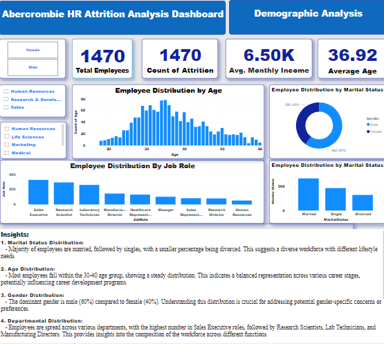
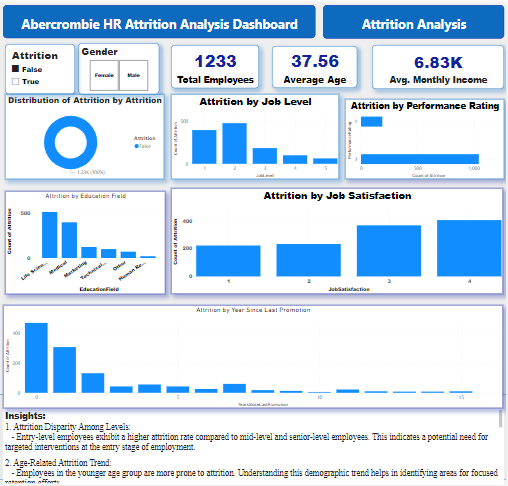
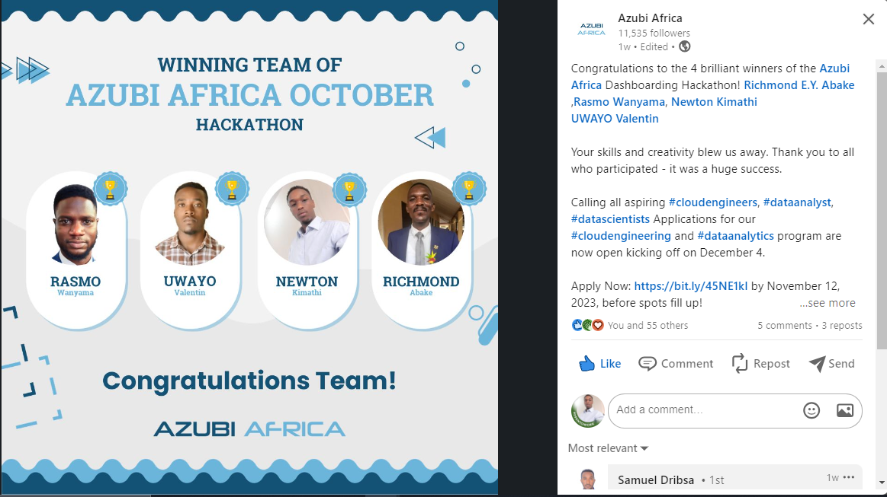

# Azubi Africa Dashboard Hackathon Winner: Abercrombie HR Analytics Dashboard
This HR Analytics Dashboard has been designed to address the rising employee attrition rates at Abercrombie Corporation. The dashboard provides insights into employee demographics, attrition analysis, and retention strategies to guide data-driven decision-making.
Below are the screenshot:

Our winning submission for the Azubi Africa Dashboard Hackathon addressed the pressing issues of rising employee attrition rates at Abercrombie Corporation, this dashboard offers a comprehensive solution for data-driven decision-making.
the link to the post is here:https://www.linkedin.com/posts/azubi-africa_cloudengineers-dataanalyst-datascientists-activity-7128340686143172609-dNwr?utm_source=share&utm_medium=member_desktop

# Recommendations
## Tailoring Benefits Based on Marital Status:

Recognize the diverse needs of employees based on marital status and consider tailoring benefits or support programs accordingly.
## Specialized Benefits:
Consider offering benefits that cater to the unique needs of married, single, and divorced employees.
## Work-Life Balance Policies:
Introduce or enhance policies that support work-life balance, especially for employees with families.
##Tailored Retention Strategies by Department:
Recognize the unique challenges and opportunities within each department. Tailor retention strategies accordingly.
## Investing in Entry-Level Development:

Implement comprehensive orientation programs and career development initiatives for entry-level staff.
## Mentorship Programs for Younger Employees:

Establish mentorship programs aimed at engaging and retaining younger employees.
## Career Development Initiatives for Younger Employees:

Create targeted career development initiatives for younger employees, focusing on skill-building and progression.
## Robust Training and Development Programs:

Invest in training and development programs for employees of all levels to enhance skills and demonstrate commitment to their professional growth.
## Regular Promotion Opportunities:

Implement a system of regular promotions based on performance and skills acquisition.

# Contributors
* Newton Kimathi
* Rasmo Wanyama
* Uwayo Valentine
* Richmond Abake